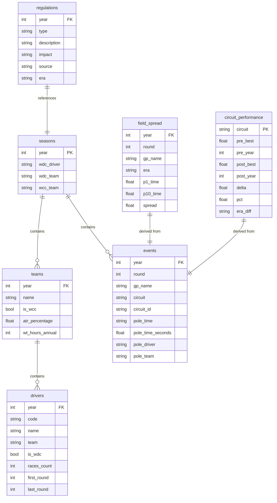

# F1 Data Management - SQL Database Schema

## Overview

| Table | Description |
|-------|-------------|
| `seasons` | F1 season years with WDC/WCC winners |
| `teams` | Teams per season with WCC and ATR |
| `drivers` | Drivers with WDC, races count |
| `events` | GPs with pole position |
| `regulations` | FIA regulations (from OpenAI) |
| `field_spread` | P1-P10 gap per GP (competitiveness) |
| `circuit_performance` | Pre/Post 2022 comparison (9 stable circuits) |

---

## ER Diagram



---

## Table Details

### `seasons`
F1 season year with championship winners.

| Column | Type | Notes |
|--------|------|-------|
| `year` | INTEGER | PK, 2017-2025 |
| `wdc_driver` | TEXT | World Drivers' Champion |
| `wdc_team` | TEXT | WDC's team |
| `wcc_team` | TEXT | World Constructors' Champion |

### `teams`
Teams for each season with WCC and ATR info.

| Column | Type | Notes |
|--------|------|-------|
| `year` | INTEGER | FK → seasons |
| `name` | TEXT | Team name |
| `is_wcc` | INTEGER | 1 = WCC winner |
| `atr_percentage` | REAL | ATR % (2021+ only) |
| `wt_hours_annual` | INTEGER | Annual wind tunnel hours |

### `drivers`
Drivers with seasonal statistics.

| Column | Type | Notes |
|--------|------|-------|
| `year` | INTEGER | FK → seasons |
| `code` | TEXT | 3-letter code (VER, HAM...) |
| `name` | TEXT | Full name |
| `team` | TEXT | Team name |
| `is_wdc` | INTEGER | 1 = WDC winner |
| `races_count` | INTEGER | Races contested |
| `first_round` | INTEGER | First race |
| `last_round` | INTEGER | Last race |

### `events`
Grand Prix with pole position data.

| Column | Type | Notes |
|--------|------|-------|
| `year` | INTEGER | FK → seasons |
| `round` | INTEGER | Race number |
| `gp_name` | TEXT | GP name |
| `circuit` | TEXT | Circuit name |
| `circuit_id` | TEXT | Stable ID for entity matching |
| `pole_time` | TEXT | Pole time (mm:ss.xxx) |
| `pole_time_seconds` | REAL | Time in seconds |
| `pole_driver` | TEXT | Poleman |
| `pole_team` | TEXT | Poleman's team |

### `regulations`
FIA regulations extracted via OpenAI API.

| Column | Type | Notes |
|--------|------|-------|
| `year` | INTEGER | FK → seasons |
| `type` | TEXT | Aero/Financial/Safety/Engine |
| `description` | TEXT | Detailed description |
| `impact` | TEXT | Major/Minor/Revolutionary |
| `source` | TEXT | Source (FIA + year) |
| `era` | TEXT | Pre-2022 / Post-2022 |

### `field_spread`
Derived table: P1-P10 gap per Grand Prix to measure field competitiveness.

| Column | Type | Notes |
|--------|------|-------|
| `year` | INTEGER | FK → seasons |
| `round` | INTEGER | Race number |
| `gp_name` | TEXT | GP name |
| `era` | TEXT | Pre-2022 / Post-2022 |
| `p1_time` | REAL | P1 best time (seconds) |
| `p10_time` | REAL | P10 best time (seconds) |
| `spread` | REAL | Gap P1-P10 (seconds) |

### `circuit_performance`
Derived table: fastest lap comparison Pre vs Post 2022 on 9 stable circuits (unchanged layout).

| Column | Type | Notes |
|--------|------|-------|
| `Circuit` | TEXT | PK - Circuit name |
| `Pre_Best` | REAL | Best pre-2022 time (seconds) |
| `Pre_Year` | INTEGER | Pre-2022 record year |
| `Post_Best` | REAL | Best post-2022 time (seconds) |
| `Post_Year` | INTEGER | Post-2022 record year |
| `Delta` | REAL | Difference (+ = slower, - = faster) |
| `Pct` | REAL | Percentage change |
| `Era_Diff` | TEXT | FASTER / SLOWER |

---

## Useful Queries

### WDC/WCC Winners
```sql
SELECT year, wdc_driver, wdc_team, wcc_team
FROM seasons ORDER BY year;
```

### Regulations by Year
```sql
SELECT year, type, description, impact
FROM regulations ORDER BY year, type;
```

### Pole Positions per Driver
```sql
SELECT pole_driver, COUNT(*) as poles 
FROM events GROUP BY pole_driver 
ORDER BY poles DESC LIMIT 10;
```

### Field Spread by Era (Competitiveness)
```sql
SELECT era, ROUND(AVG(spread), 2) as avg_spread, COUNT(*) as races
FROM field_spread
GROUP BY era;
-- Result: Pre-2022: 2.55s, Post-2022: 2.15s → More competitive!
```

### Circuit Performance: Pre vs Post 2022
```sql
SELECT Circuit, Delta, Pct, Era_Diff
FROM circuit_performance
ORDER BY Delta;
```

---

## Design Rationale

This database follows a **Data Mart** approach optimized for the research question:
> *"Did ground effect regulations improve competitiveness and performance?"*

| Table | Answers |
|-------|---------|
| `field_spread` | **Competitiveness** (P1-P10 gap by era) |
| `circuit_performance` | **Speed** (Pre/Post 2022 on stable circuits) |
| `regulations` | **Context** (when ground effect was introduced) |
| `seasons` | **Dominance** (WDC/WCC patterns) |

The raw qualifying dataset (3853 records) is kept in Pandas for flexible analysis, while SQL stores only aggregated/dimensional tables needed for final insights.
