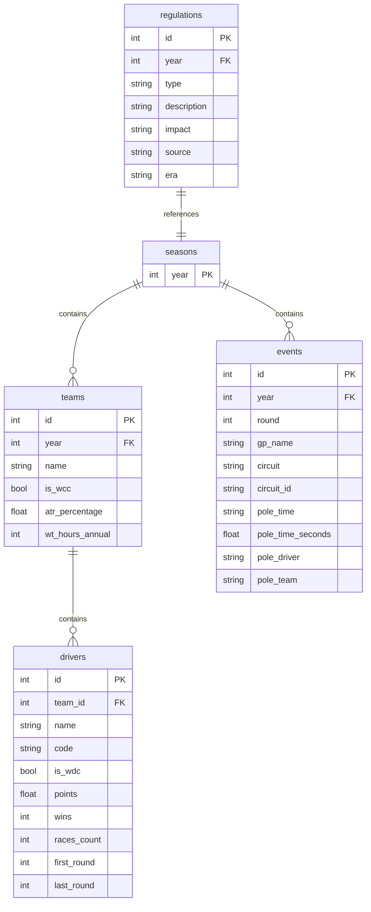

# F1 Data Management - Schema Database SQL

## Panoramica

| Tabella | Descrizione | Records (stimati) |
|---------|-------------|-------------------|
| `seasons` | Anni di stagione F1 | 9 |
| `teams` | Team per stagione con WCC e ATR | ~90 |
| `drivers` | Piloti con WDC, punti e vittorie | ~180 |
| `events` | GP con pole position | ~190 |
| `regulations` | Regolamenti FIA (da OpenAI) | ~37 |

---

## Diagramma ER



---

## Dettaglio Tabelle

### `seasons`
Anno della stagione F1.

| Colonna | Tipo | Note |
|---------|------|------|
| `year` | INTEGER | PK, 2017-2025 |

### `teams`
Team per ogni stagione con info WCC e ATR.

| Colonna | Tipo | Note |
|---------|------|------|
| `year` | INTEGER | FK → seasons |
| `name` | TEXT | Nome team |
| `is_wcc` | INTEGER | 1 = vincitore WCC |
| `atr_percentage` | REAL | % ATR (solo 2022+) |
| `wt_hours_annual` | INTEGER | Ore wind tunnel annuali |

### `drivers`
Piloti con statistiche stagionali.

| Colonna | Tipo | Note |
|---------|------|------|
| `team_id` | INTEGER | FK → teams.rowid |
| `name` | TEXT | Nome completo |
| `code` | TEXT | Codice 3 lettere (VER, HAM...) |
| `is_wdc` | INTEGER | 1 = vincitore WDC |
| `points` | REAL | Punti totali stagione |
| `wins` | INTEGER | Vittorie |
| `races_count` | INTEGER | Gare disputate |
| `first_round` | INTEGER | Prima gara |
| `last_round` | INTEGER | Ultima gara |

### `events`
Gran Premi con dati pole position.

| Colonna | Tipo | Note |
|---------|------|------|
| `year` | INTEGER | FK → seasons |
| `round` | INTEGER | Numero gara |
| `gp_name` | TEXT | Nome GP |
| `circuit` | TEXT | Nome circuito |
| `circuit_id` | TEXT | ID stabile per entity matching |
| `pole_time` | TEXT | Tempo pole (mm:ss.xxx) |
| `pole_time_seconds` | REAL | Tempo in secondi |
| `pole_driver` | TEXT | Poleman |
| `pole_team` | TEXT | Team poleman |

### `regulations`
Regolamenti FIA estratti via OpenAI API.

| Colonna | Tipo | Note |
|---------|------|------|
| `year` | INTEGER | FK → seasons |
| `type` | TEXT | Aero/Financial/Safety/Engine |
| `description` | TEXT | Descrizione dettagliata |
| `impact` | TEXT | Major/Minor/Revolutionary |
| `source` | TEXT | Fonte (FIA + anno) |
| `era` | TEXT | Pre-2022 / Post-2022 |

---

## Query Utili

### WDC/WCC Winners
```sql
SELECT t.year, d.name AS wdc, t.name AS team, 
       (SELECT name FROM teams WHERE year=t.year AND is_wcc=1) AS wcc
FROM teams t JOIN drivers d ON t.rowid = d.team_id
WHERE d.is_wdc = 1 ORDER BY t.year;
```

### Regulations by Year
```sql
SELECT year, type, description, impact
FROM regulations ORDER BY year, type;
```

### Pole Positions per Driver
```sql
SELECT pole_driver, COUNT(*) as poles 
FROM events GROUP BY pole_driver 
ORDER BY poles DESC LIMIT 10;
```
