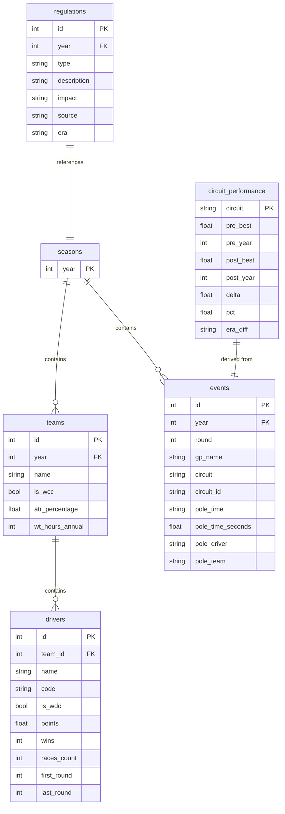

# F1 Data Management - SQL Database Schema

## Overview

| Table | Description | Records (estimated) |
|-------|-------------|---------------------|
| `seasons` | F1 season years | 9 |
| `teams` | Teams per season with WCC and ATR | ~90 |
| `drivers` | Drivers with WDC, points and wins | ~180 |
| `events` | GPs with pole position | ~190 |
| `regulations` | FIA regulations (from OpenAI) | ~37 |
| `circuit_performance` | Pre/Post 2022 comparison (9 stable circuits) | 9 |

---

## ER Diagram



---

## Table Details

### `seasons`
F1 season year.

| Column | Type | Notes |
|--------|------|-------|
| `year` | INTEGER | PK, 2017-2025 |

### `teams`
Teams for each season with WCC and ATR info.

| Column | Type | Notes |
|--------|------|-------|
| `year` | INTEGER | FK → seasons |
| `name` | TEXT | Team name |
| `is_wcc` | INTEGER | 1 = WCC winner |
| `atr_percentage` | REAL | ATR % (2022+ only) |
| `wt_hours_annual` | INTEGER | Annual wind tunnel hours |

### `drivers`
Drivers with seasonal statistics.

| Column | Type | Notes |
|--------|------|-------|
| `team_id` | INTEGER | FK → teams.rowid |
| `name` | TEXT | Full name |
| `code` | TEXT | 3-letter code (VER, HAM...) |
| `is_wdc` | INTEGER | 1 = WDC winner |
| `points` | REAL | Total season points |
| `wins` | INTEGER | Wins |
| `races_count` | INTEGER | Races contested |
| `first_round` | INTEGER | First race |
| `last_round` | INTEGER | Last race |

### `events`
Grand Prix with pole position data.

| Column | Type | Notes |
|--------|------|-------|
| `year` | INTEGER | FK → seasons |
| `round` | INTEGER | Race number |
| `gp_name` | TEXT | GP name |
| `circuit` | TEXT | Circuit name |
| `circuit_id` | TEXT | Stable ID for entity matching |
| `pole_time` | TEXT | Pole time (mm:ss.xxx) |
| `pole_time_seconds` | REAL | Time in seconds |
| `pole_driver` | TEXT | Poleman |
| `pole_team` | TEXT | Poleman's team |

### `regulations`
FIA regulations extracted via OpenAI API.

| Column | Type | Notes |
|--------|------|-------|
| `year` | INTEGER | FK → seasons |
| `type` | TEXT | Aero/Financial/Safety/Engine |
| `description` | TEXT | Detailed description |
| `impact` | TEXT | Major/Minor/Revolutionary |
| `source` | TEXT | Source (FIA + year) |
| `era` | TEXT | Pre-2022 / Post-2022 |

### `circuit_performance`
Derived table: fastest lap comparison Pre vs Post 2022 on 9 stable circuits (unchanged layout).

| Column | Type | Notes |
|--------|------|-------|
| `Circuit` | TEXT | PK - Circuit name |
| `Pre_Best` | REAL | Best pre-2022 time (seconds) |
| `Pre_Year` | INTEGER | Pre-2022 record year |
| `Post_Best` | REAL | Best post-2022 time (seconds) |
| `Post_Year` | INTEGER | Post-2022 record year |
| `Delta` | REAL | Difference (+ = slower, - = faster) |
| `Pct` | REAL | Percentage change |
| `Era_Diff` | TEXT | FASTER / SLOWER |

---

## Useful Queries

### WDC/WCC Winners
```sql
SELECT t.year, d.name AS wdc, t.name AS team, 
       (SELECT name FROM teams WHERE year=t.year AND is_wcc=1) AS wcc
FROM teams t JOIN drivers d ON t.rowid = d.team_id
WHERE d.is_wdc = 1 ORDER BY t.year;
```

### Regulations by Year
```sql
SELECT year, type, description, impact
FROM regulations ORDER BY year, type;
```

### Pole Positions per Driver
```sql
SELECT pole_driver, COUNT(*) as poles 
FROM events GROUP BY pole_driver 
ORDER BY poles DESC LIMIT 10;
```

### Circuit Performance: Pre vs Post 2022
```sql
SELECT Circuit, Delta, Pct, Era_Diff
FROM circuit_performance
ORDER BY Delta;
```
